# Spark Machine Learning Homework

## Screenshots from following the notebook steps

* Cloudpickle installation

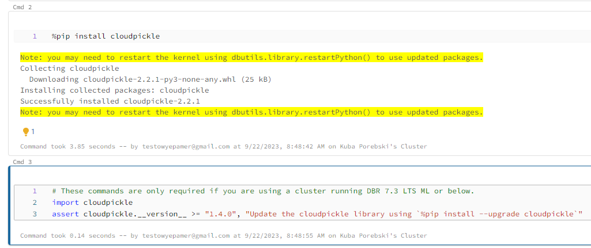

* Importing data into DBFS and preparing it was done correctly. I followed instructions and uploaded data via Databricks UI.  
* So this time, there was no need for another Google Cloud bucket, I didn't have to use `terraform`.
* Here you can see the resulting pandas dataset:

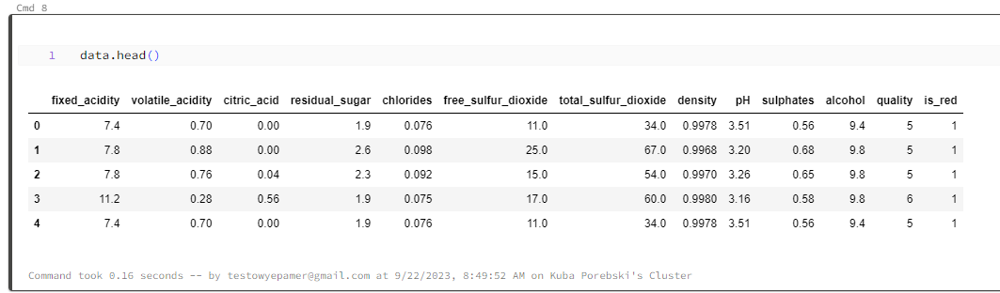

* How's quality of wine distributed? Histogram shows it:

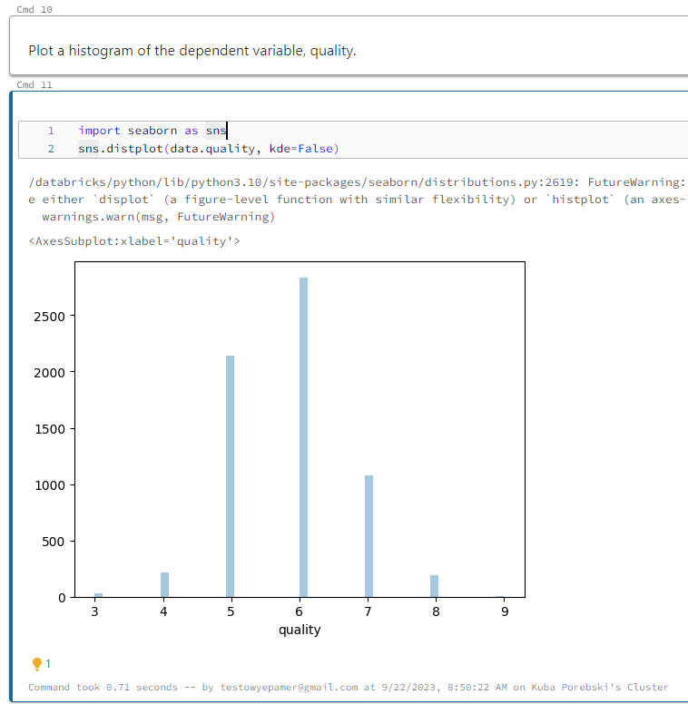

* In the dataset independent variables are variables used to predict a dependent variable. So, we use `fixed_acidity`, `citric_acid`, `density`, `pH`, `alcohol`, etc. 
to predict dependent variable with name `quality`.
* Independent variables vs. dependent variable, visualized in a series of plots:

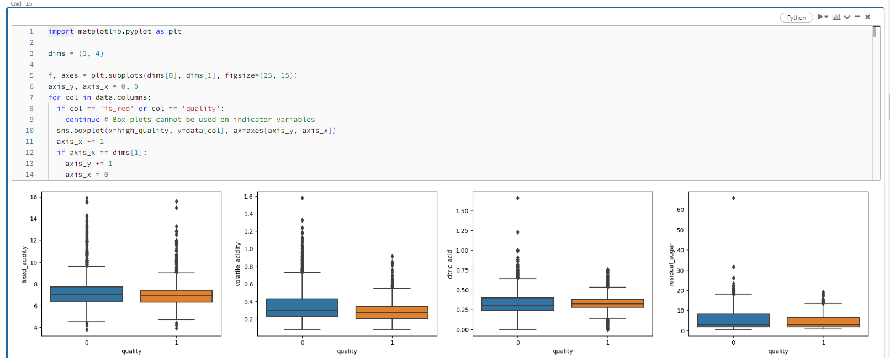
* 
* Let's train dataset and run machine learning. We're using `MLFlow` framework to do it.
* After ML training, we know what features have most impact on the wine quality. Let's check:

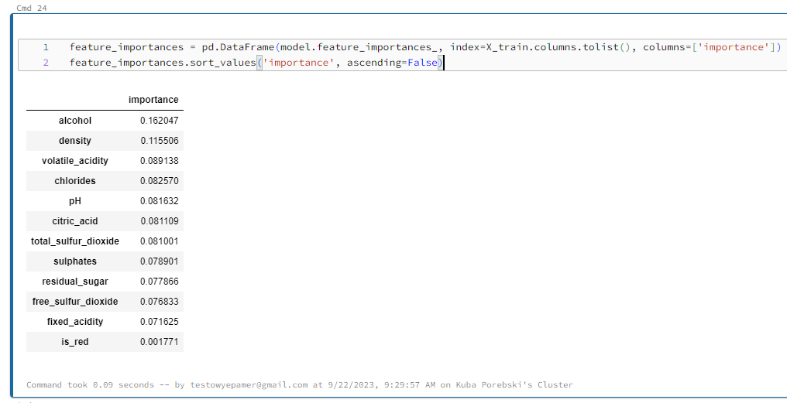

* After training, we can register a resulting model.

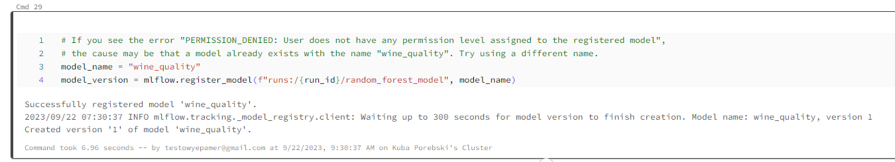

* We can promote this model to a production stage.

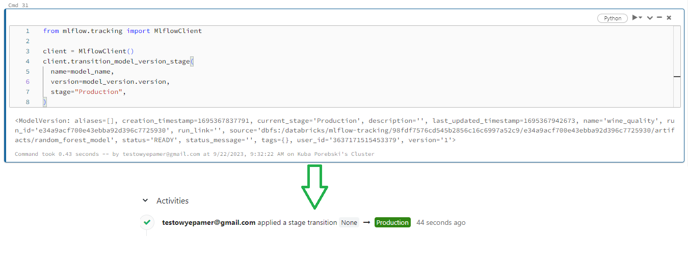

* What is AUC (area under curve) of that registered model?

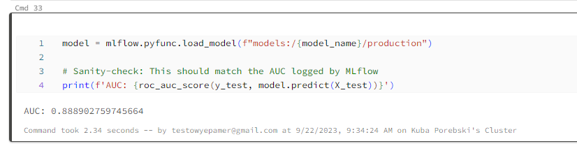

* Now, onto the advanced features of Machine Learning. Let's try a hyperparameter sweep.

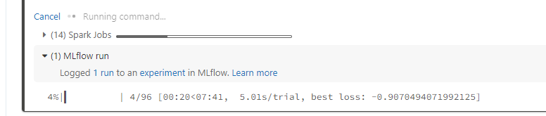

* We can go into MLFlow dedicated page and see on the parallel coordinates plots how was a run:

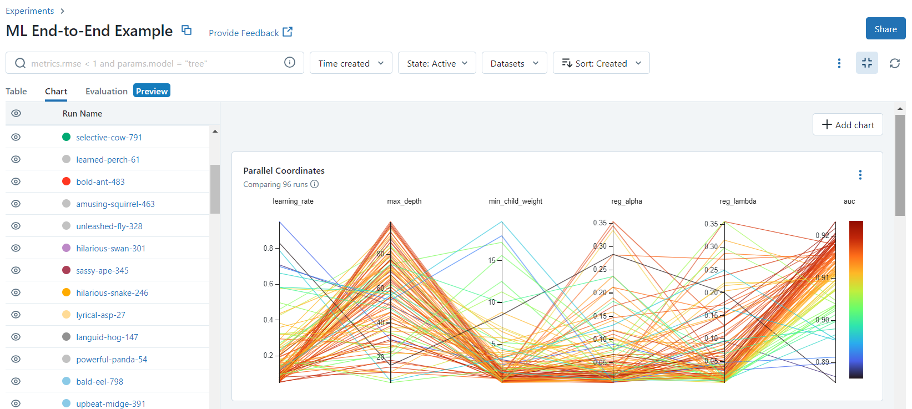

* Let's promote the best performing model to a production stage, and archive an old version of previous one.

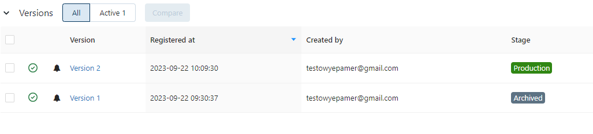

* We can serve this model - the newest version of it - as well.

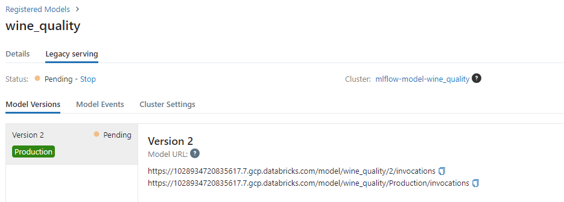

* And done!
